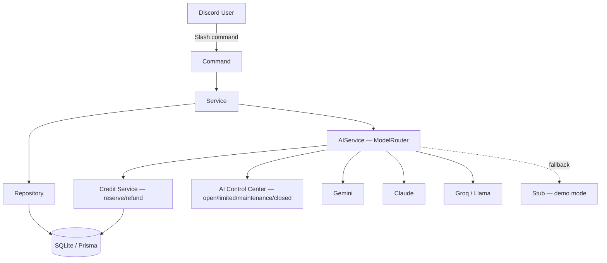

# 🧠 Nodify

**Smart technical education platform for Discord** — development,
cybersecurity, AI, and documentation, all in one bot. Nodify is **not**
a moderation bot: it's entirely dedicated to learning.

<p align="left">
  
  
  
  
  <a href="https://github.com/HigHollows/Nodify-Learning-/actions/workflows/ci.yml"></a>
  
  
</p>

---

## ✨ Overview

| Domain | What it does |
|---|---|
| 🎓 **Academy** | Interactive courses (JS, Python, TypeScript, Docker...) with quizzes, real XP, and adaptive progression |
| 🛡️ **Cyber Academy** | Cybersecurity Fundamentals, Red Team, Blue Team, CTF (crypto/OSINT/forensics/static web), Trust Nothing Simulation |
| 📖 **Knowledge Engine** | Technical dictionary with fuzzy search (typo-tolerant) |
| 🤖 **AI** | ExplainMe, code review, threat modeling, RAG documentation, learning planner |
| 🏆 **Gamification** | XP, levels, dynamic Discord roles, streaks, achievements, leaderboards |
| 🌐 **Community** | Automatic daily question, Hacktualités (real RSS feeds) |
| 💳 **AI Credits** | Non-monetary credit system for AI usage, daily/weekly/monthly and learning rewards, automatic refund on failure |
| ⚙️ **Admin** | `/setup` auto-configuration, modular `/settings`, `/stats`, AI Control Center (`/ai`) |

## 🏗️ Architecture



```
src/
├── commands/         Slash commands (Command → Service → Repository → DB)
├── events/           Discord.js handlers (ready, interactionCreate...)
├── interactions/      Buttons, Modals, Autocomplete
├── loaders/           Dynamic loading of commands/events
├── database/           Prisma client + repositories
├── config/             Environment variable validation (zod)
├── utils/               Logger, typed errors, rate limiter, leveling
├── ai/                 Centralized AIService (Gemini / Anthropic / Groq / Stub)
├── credits/             Credit Engine, Reward Engine, AI Control Center
├── knowledge/           Knowledge Engine (concepts, dictionary)
├── education/            Academy (courses, quizzes, progression)
├── cybersecurity/          Cyber Academy, CTF, Blue/Red Team, Trust Sim
├── documentation/           RAG over technical docs
├── community/                Daily question, Hacktualités
└── setup/                     /setup, /settings, role sync
```

Every command stays thin: all business logic lives in a **service**,
which talks to the DB through a **repository** — never a direct Prisma
query inside a command.

## 🚀 Setup

1. Copy `.env.example` to `.env` and fill in:
   - `DISCORD_TOKEN` and `DISCORD_CLIENT_ID` ([Discord Developer Portal](https://discord.com/developers/applications))
   - `DISCORD_GUILD_ID` (optional in dev — instant command deployment)
   - an optional AI key (`GEMINI_API_KEY`, `ANTHROPIC_API_KEY`, or `GROQ_API_KEY`) — without a key, the bot runs in demo mode
   - the credit system is enabled by default (`CREDITS_ENABLED=true`); see `.env.example` for all settings (rewards, anti-abuse, default AI mode)

2. Install dependencies:
   ```bash
   npm install
   ```

3. Create and seed the database:
   ```bash
   npm run prisma:migrate -- --name init
   npm run prisma:seed
   ```

4. Deploy slash commands to Discord (optional — the bot also
   resyncs them automatically on every startup):
   ```bash
   npm run deploy:commands
   ```

5. Start the bot:
   ```bash
   npm run dev
   ```

## 📦 Deployment (Pterodactyl/Bot-Hosting-style hosts)

These panels typically run `npm install && node index.js`, with no
configurable build/migration step. Two mechanisms handle this automatically:

- **`postinstall`** (package.json) generates the Prisma client and compiles
  TypeScript on every `npm install`
- **`index.js`** (root) applies Prisma migrations, then starts the
  compiled code

Just fill in the panel's environment variables — no build command to
configure.

## ✅ Verifying it works

Once the bot is online, `/ping` should respond with latency, and `/help`
lists every available command grouped by domain.

## 🧰 Scripts

| Command | Effect |
|---|---|
| `npm run dev` | Bot in watch mode (auto-reload) |
| `npm run build` | Compiles TypeScript → `dist/` |
| `npm start` | Runs the compiled build |
| `npm run deploy:commands` | Manually (re)deploys slash commands (also done automatically on every bot startup) |
| `npm run prisma:migrate` | Applies a DB migration |
| `npm run prisma:studio` | GUI for inspecting the DB |
| `npm run typecheck` | Checks types without compiling |
| `npm test` | Runs the test suite (vitest) |
| `npm run test:watch` | Tests in watch mode |

> 📄 The precise details of each command (how it works, design decisions,
> what's intentionally not built) are in
> [`docs/ARCHITECTURE.md`](docs/ARCHITECTURE.md).

## 📋 Commands

<details>
<summary>👤 Profile & Progression</summary>

- `/profile` — global profile (XP, level, streak, skills, achievements)
- `/leaderboard` — XP leaderboard
- `/setup` — automatic configuration (roles, hub channel), idempotent
</details>

<details>
<summary>📖 Knowledge Engine</summary>

- `/dictionary` (+ aliases `/dict` `/term` `/define`) — technical dictionary, fuzzy search
</details>

<details>
<summary>🎓 Academy</summary>

- `/learn` — interactive courses (quizzes, XP, prerequisites)
- `/plan` — personalized learning path generated by AI, based on real courses
</details>

<details>
<summary>🤖 AI</summary>

- `/explainme` — level-adapted explanation, with follow-up conversation
- `/docs` — search technical documentation (RAG)
</details>

<details>
<summary>🛠️ Dev Tools</summary>

- `/securityreview` — security audit of a code snippet
- `/codereview` — quality review (readability, duplication)
- `/debugme` — Socratic-style Debug Coach
- `/threatmodel` — risk analysis on a described architecture
</details>

<details>
<summary>🛡️ Cyber Academy</summary>

- `/cyber learn` — cybersecurity courses
- `/cyber simulation` — Trust Nothing Simulation (phishing, 100% simulated)
- `/cyber blueteam` — log analysis, spot an IOC
- `/cyber ctf list|challenge|leaderboard` — crypto/OSINT/forensics/web (static) challenges
</details>

<details>
<summary>🌐 Community</summary>

- `/trivia` — question of the day (also posted automatically)
- `/news` — latest Hacktualités (real RSS feeds)
</details>

<details>
<summary>💳 Credits & Rewards</summary>

- `/credits` — explains the system (balance, rewards, AI costs)
- `/balance` — your wallet (balance, recent activity, next reward)
- `/credit-stats` — detailed stats (total earned/spent/refunded, AI usage)
- `/credit-history` — paginated transaction history
- `/ai-costs` — credit cost of each AI feature
- `/daily`, `/weekly`, `/monthly` — free periodic rewards (cooldown enforced server-side)
</details>

<details>
<summary>⚙️ Admin</summary>

- `/settings` — enable/disable modules per server
- `/stats` — global statistics
- `/credit-admin give|remove|set|bonus|subscriber` — manage a user's credits (audited): grant/remove/set, one-off event bonus, non-monetary supporter status
- `/ai status|open|close|maintenance|limited|stats|usage|panel|budget|audit-log` — AI Control Center: toggle AI service mode (without affecting the rest of Nodify), paginated usage stats/history, persistent status panel, per-server AI budget, audit log
</details>

## 📊 Current content

| Catalog | Volume |
|---|---|
| Dictionary concepts | 53 |
| Daily questions | 158 |
| Academy courses (all domains covered) | 11 |
| CTF challenges (crypto/OSINT/forensics/web) | 8 |
| Hacktualités sources (real RSS) | 10 |
| Documentation excerpts (RAG) | 10 |

## 🗺️ Roadmap

- ✅ Foundations, `/setup`, global profile, gamification
- ✅ Knowledge Engine, Academy, AIService (Anthropic/Groq)
- ✅ Dev Tools, Cyber Academy (CTF, Blue/Red Team), Hacktualités
- ✅ Discord role sync, course prerequisites, `/plan`, `/stats`, `/settings`
- ✅ Expanded content: dictionary (53), daily questions (158), Academy across
  all 6 domains (11 courses), diversified Hacktualités (10 sources, fair
  selection), static Web CTF (artifact analysis, no real network target)
- ✅ AI Credit System & AI Control Center: non-monetary credits, atomic
  reserve/refund, generic Reward Engine, Gemini provider, computed AI
  status + persistent panel, configurable anti-abuse, admin audit
- ✅ Multi-provider with per-provider cost, per-server AI budgets, real
  request cancellation on timeout, AI Incident alerts, event bonuses and
  supporter status, audit log finally viewable from Discord (`/ai audit-log`)
- ⏳ CTF Pwn/Network/Reverse and Labs with live targets — require real
  sandbox/VM infrastructure that doesn't exist, intentionally not simulated
  without it (Web CTF stays static, no real application to attack)

## 🧪 Quality

- Strict TypeScript (`exactOptionalPropertyTypes`, `noUncheckedIndexedAccess`)
- Automated tests (vitest) on pure logic
- GitHub Actions CI: typecheck + tests on every push
- All application errors are typed, never a silent `try/catch`
