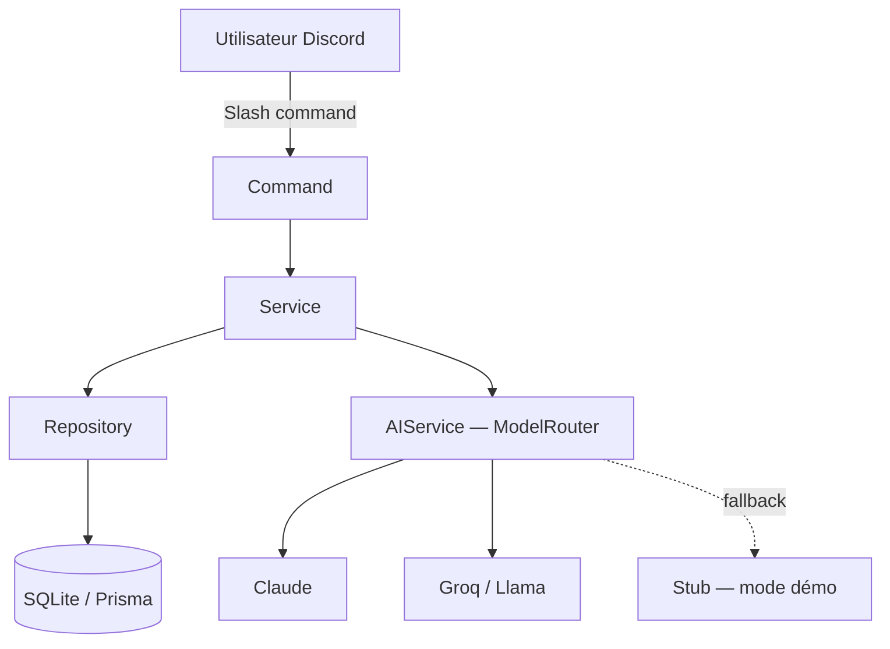

# 🧠 Nodify

**Plateforme éducative technique intelligente pour Discord** — développement,
cybersécurité, IA et documentation, dans un seul bot. Nodify n'est **pas**
un bot de modération : il est entièrement dédié à l'apprentissage.

<p align="left">
  
  
  
  
  <a href="https://github.com/HigHollows/Nodify-Learning-/actions/workflows/ci.yml"></a>
  
  
</p>

---

## ✨ Aperçu

| Domaine | Ce que ça fait |
|---|---|
| 🎓 **Academy** | Cours interactifs (JS, Python, TypeScript, Docker...) avec quiz, XP réelle et progression adaptative |
| 🛡️ **Cyber Academy** | Cybersecurity Fundamentals, Red Team, Blue Team, CTF (crypto/OSINT/forensics), Trust Nothing Simulation |
| 📖 **Knowledge Engine** | Dictionnaire technique avec recherche floue (tolère les fautes de frappe) |
| 🤖 **IA** | ExplainMe, review de code, threat modeling, RAG documentation, learning planner |
| 🏆 **Gamification** | XP, niveaux, rôles Discord dynamiques, streaks, achievements, leaderboards |
| 🌐 **Communauté** | Question du jour automatique, Hacktualités (vrais flux RSS) |
| ⚙️ **Admin** | `/setup` auto-configuration, `/settings` modulaire, `/stats` |

## 🖼️ Aperçu visuel

> Screenshots à venir — le bot est fonctionnel mais pas encore capturé en
> situation réelle. Si tu ajoutes des images, dépose-les dans `docs/screenshots/`
> et référence-les ici, par exemple :
> ``

## 🏗️ Architecture



```
src/
├── commands/         Slash commands (Command → Service → Repository → DB)
├── events/           Handlers Discord.js (ready, interactionCreate...)
├── interactions/      Boutons, Modals, Autocomplete
├── loaders/           Chargement dynamique commandes/events
├── database/           Client Prisma + repositories
├── config/             Validation des variables d'environnement (zod)
├── utils/               Logger, erreurs typées, rate limiter, leveling
├── ai/                 AIService centralisé (Anthropic / Groq / Stub)
├── knowledge/           Knowledge Engine (concepts, dictionnaire)
├── education/            Academy (cours, quiz, progression)
├── cybersecurity/          Cyber Academy, CTF, Blue/Red Team, Trust Sim
├── documentation/           RAG sur docs techniques
├── community/                Question du jour, Hacktualités
└── setup/                     /setup, /settings, sync des rôles
```

Chaque commande reste fine : toute la logique métier vit dans un **service**,
qui parle à la DB via un **repository** — jamais de requête Prisma directe
dans une commande.

## 🚀 Installation

1. Copier `.env.example` en `.env` et renseigner :
   - `DISCORD_TOKEN` et `DISCORD_CLIENT_ID` ([Discord Developer Portal](https://discord.com/developers/applications))
   - `DISCORD_GUILD_ID` (optionnel en dev — déploiement instantané des commandes)
   - une clé IA optionnelle (`ANTHROPIC_API_KEY` ou `GROQ_API_KEY`) — sans clé, le bot tourne en mode démonstration

2. Installer les dépendances :
   ```bash
   npm install
   ```

3. Créer la base et la peupler :
   ```bash
   npm run prisma:migrate -- --name init
   npm run prisma:seed
   ```

4. Déployer les slash commands sur Discord :
   ```bash
   npm run deploy:commands
   ```

5. Lancer le bot :
   ```bash
   npm run dev
   ```

## 📦 Déploiement (hébergeur type Pterodactyl/Bot-Hosting)

Ces panels lancent typiquement `npm install && node index.js`, sans étape de
build/migration configurable. Deux mécanismes s'en chargent automatiquement :

- **`postinstall`** (package.json) génère le client Prisma et compile
  TypeScript à chaque `npm install`
- **`index.js`** (racine) applique les migrations Prisma puis démarre le
  code compilé

Il suffit de renseigner les variables d'environnement du panel — aucune
commande de build à configurer.

## ✅ Vérifier que ça marche

Une fois le bot en ligne, `/ping` doit répondre avec la latence, et `/help`
liste toutes les commandes disponibles groupées par domaine.

## 🧰 Scripts

| Commande | Effet |
|---|---|
| `npm run dev` | Bot en mode watch (rechargement auto) |
| `npm run build` | Compile TypeScript → `dist/` |
| `npm start` | Lance la version compilée |
| `npm run deploy:commands` | (Re)déploie les slash commands sur Discord |
| `npm run prisma:migrate` | Applique une migration DB |
| `npm run prisma:studio` | Interface graphique pour inspecter la DB |
| `npm run typecheck` | Vérifie les types sans compiler |
| `npm test` | Lance la suite de tests (vitest) |
| `npm run test:watch` | Tests en mode watch |

> 📄 Le détail précis de chaque commande (fonctionnement, décisions de
> conception, ce qui est volontairement non construit) est dans
> [`docs/ARCHITECTURE.md`](docs/ARCHITECTURE.md).

## 📋 Commandes

<details>
<summary>👤 Profil & Progression</summary>

- `/profile` — profil global (XP, niveau, streak, compétences, achievements)
- `/leaderboard` — classement par XP
- `/setup` — configuration automatique (rôles, salon hub), idempotente
</details>

<details>
<summary>📖 Knowledge Engine</summary>

- `/dictionary` (+ alias `/dict` `/term` `/define`) — dictionnaire technique, recherche floue
</details>

<details>
<summary>🎓 Academy</summary>

- `/learn` — cours interactifs (quiz, XP, prérequis)
- `/plan` — parcours personnalisé généré par IA, à partir des cours réels
</details>

<details>
<summary>🤖 IA</summary>

- `/explainme` — explication adaptée au niveau, avec suivi de conversation
- `/docs` — recherche dans la documentation technique (RAG)
</details>

<details>
<summary>🛠️ Dev Tools</summary>

- `/securityreview` — audit sécurité d'un extrait de code
- `/codereview` — relecture qualité (lisibilité, duplication)
- `/debugme` — Debug Coach façon tuteur socratique
- `/threatmodel` — analyse de risques sur une architecture décrite
</details>

<details>
<summary>🛡️ Cyber Academy</summary>

- `/cyber learn` — cours de cybersécurité
- `/cyber simulation` — Trust Nothing Simulation (phishing, 100% simulé)
- `/cyber blueteam` — analyse de logs, repérer un IOC
- `/cyber ctf list|challenge|leaderboard` — défis crypto/OSINT/forensics
</details>

<details>
<summary>🌐 Communauté</summary>

- `/daily` — question du jour (aussi postée automatiquement)
- `/news` — dernières Hacktualités (vrais flux RSS)
</details>

<details>
<summary>⚙️ Admin</summary>

- `/settings` — active/désactive les modules par serveur
- `/stats` — statistiques globales
</details>

## 📊 Contenu actuel

| Catalogue | Volume |
|---|---|
| Concepts du dictionnaire | 47 |
| Questions du jour | 158 |
| Cours Academy (tous domaines couverts) | 9 |
| Défis CTF | 4 |
| Sources Hacktualités (RSS réelles) | 10 |
| Extraits de documentation (RAG) | 10 |

## 🗺️ Roadmap

- ✅ Fondations, `/setup`, profil global, gamification
- ✅ Knowledge Engine, Academy, AIService (Anthropic/Groq)
- ✅ Dev Tools, Cyber Academy (CTF, Blue/Red Team), Hacktualités
- ✅ Sync de rôles Discord, prérequis entre cours, `/plan`, `/stats`, `/settings`
- ✅ Contenu étoffé : dictionnaire (47), questions du jour (158), Academy sur
  les 6 domaines, Hacktualités diversifiées (10 sources, sélection équitable)
- ⏳ CTF Web/Pwn/Network/Reverse et Labs avec cibles en direct — nécessitent
  une vraie infrastructure de sandbox/VM isolée, volontairement pas simulés
  sans elle

## 🧪 Qualité

- TypeScript strict (`exactOptionalPropertyTypes`, `noUncheckedIndexedAccess`)
- Tests automatisés (vitest) sur la logique pure
- CI GitHub Actions : typecheck + tests à chaque push
- Toutes les erreurs applicatives typées, jamais de `try/catch` silencieux
